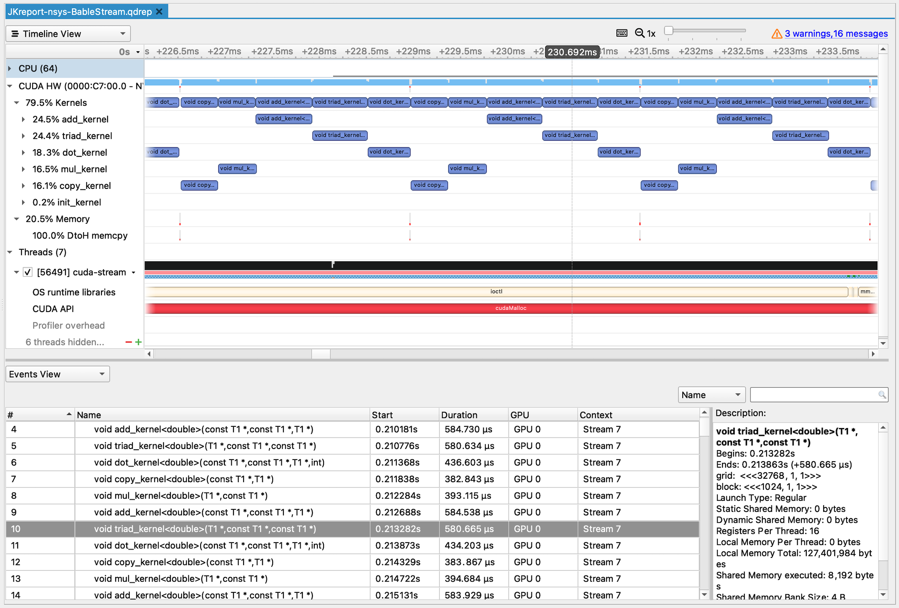
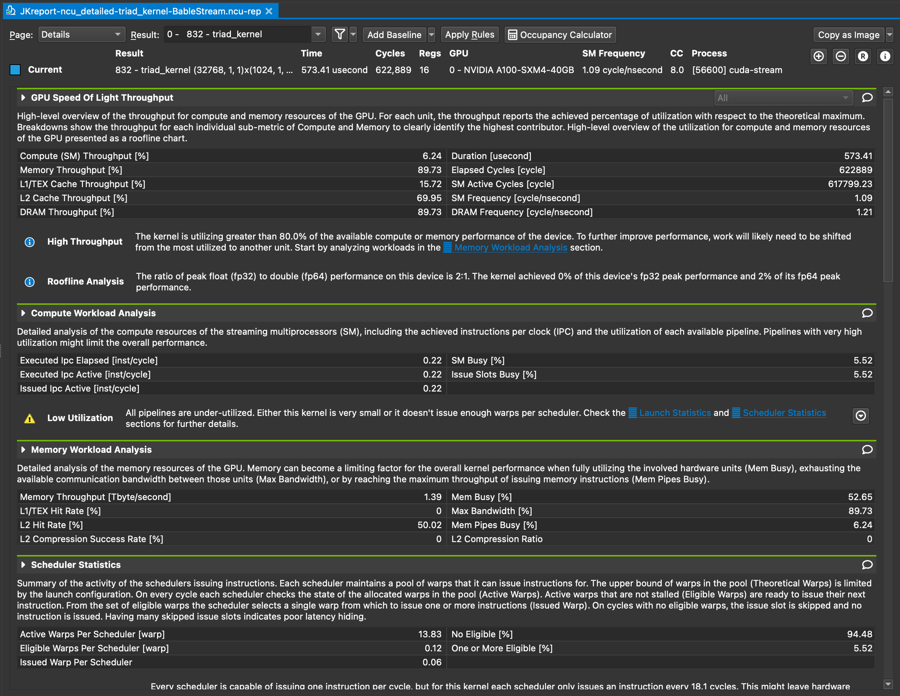
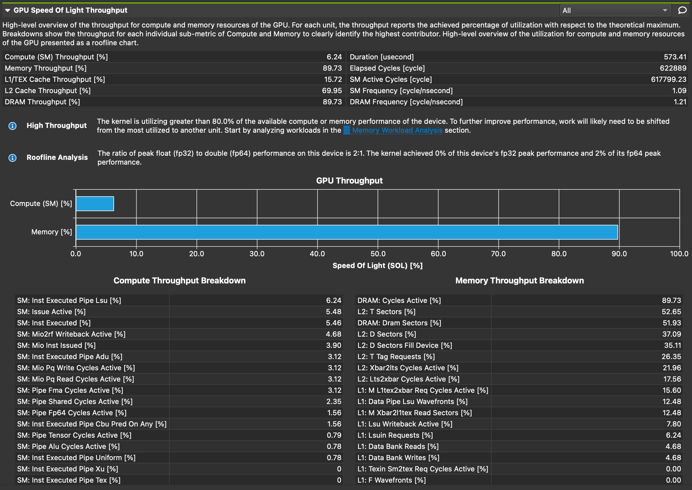
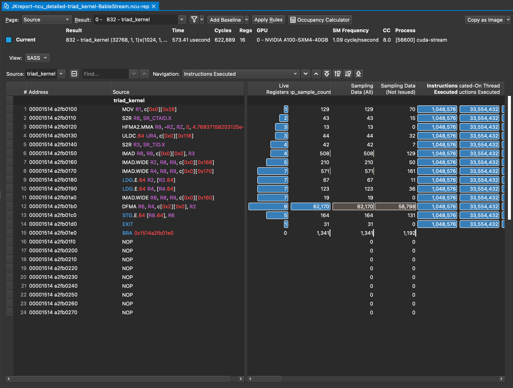

# NVIDIA Nsight tools

## References  
[NVIDIA Nsight Systems Documentation](https://docs.nvidia.com/nsight-systems/UserGuide/index.html)  
[NVIDIA Nsight Compute Documentation](https://docs.nvidia.com/nsight-compute/NsightCompute/index.html)

## Introduction
NVIDIA® Nsight™ Systems provides developers a system-wide visualization of an applications performance. Developers can optimize bottlenecks to scale efficiently across any number or size of CPUs and GPUs on Polaris. For further optimizations to compute kernels developers should use Nsight Compute.

The NVIDIA Nsight Compute is an interactive kernel profiler for CUDA applications. It provides detailed performance metrics and API debugging via a user interface and command line tool. 

In addition, the baseline feature of this tool allows users to compare results within the tool. NVIDIA Nsight Compute provides a customizable and data-driven user interface,  metric collection, and can be extended with analysis scripts for post-processing results.

## Step-by-step guide
### Common part on Polaris
Build your application for Polaris, and then submit your job script to Polaris or start an interactive job mode on Polaris as follows:  
```
$ qsub -I -l select=1 -l walltime=1:00:00

$ nsys --version
NVIDIA Nsight Systems version 2021.3.1.54-ee9c30a

$ ncu --version
NVIDIA (R) Nsight Compute Command Line Profiler
Copyright (c) 2018-2021 NVIDIA Corporation
Version 2021.2.1.0 (build 30182073) (public-release)
```


### Nsight Systems
Run your application with Nsight Systems as follows:  
```
$ nsys profile -o {output_filename} --stats=true ./{your_application}
```

### Nsight Compute
Run your application with Nsight Compute.  
```
$ ncu --set detailed -k {kernel_name} -o {output_filename} ./{your_application}
```

Remark: Without -o option, Nsight Compute provides performance data as a standard output

### Post-processing the profiled data
#### Post-processing via CLI
```
$ nsys stats {output_filename}.qdrep
$ ncu -i {output_filename}.ncu-rep  
```

#### Post-processing on your local system via GUI
* Install NVIDIA Nsight Systems and NVIDIA Nsight Compute after downloading both of them from the  [NVIDIA Developer Zone](https://developer.nvidia.com/).   
Remark: Local client version should be the same as or newer than NVIDIA Nsight tools on Polaris. 
* Download nsys output files (i.e., ending with .qdrep and . sqlite) to your local system, and then open them with NVIDIA Nsight Systems on your local system.  
* Download ncu output files (i.e., ending with .ncu-rep) to your local system, and then open them with NVIDIA Nsight Compute on your local system.  

### More options for performance analysis with Nsight Systems and Nsight Compute
```
$ nsys --help
$ ncu --help
```

## A quick example

### Nsight Systems
#### Running a stream benchmark with Nsight Systems
```
jkwack@x3008c0s13b1n0:~/BabelStream/build_polaris> nsys profile -o JKreport-nsys-BableStream --stats=true ./cuda-stream
Warning: LBR backtrace method is not supported on this platform. DWARF backtrace method will be used.
Collecting data...
BabelStream
Version: 4.0
Implementation: CUDA
Running kernels 100 times
Precision: double
Array size: 268.4 MB (=0.3 GB)
Total size: 805.3 MB (=0.8 GB)
Using CUDA device NVIDIA A100-SXM4-40GB
Driver: 11040
Function    MBytes/sec  Min (sec)   Max         Average     
Copy        1368294.603 0.00039     0.00044     0.00039     
Mul         1334324.779 0.00040     0.00051     0.00041     
Add         1358476.737 0.00059     0.00060     0.00059     
Triad       1366095.332 0.00059     0.00059     0.00059     
Dot         1190200.569 0.00045     0.00047     0.00046     
Processing events...
Saving temporary "/var/tmp/pbs.308834.polaris-pbs-01.hsn.cm.polaris.alcf.anl.gov/nsys-report-f594-c524-6b4c-300a.qdstrm" file to disk...

Creating final output files...
Processing [===============================================================100%]
Saved report file to "/var/tmp/pbs.308834.polaris-pbs-01.hsn.cm.polaris.alcf.anl.gov/nsys-report-f594-c524-6b4c-300a.qdrep"
Exporting 7675 events: [===================================================100%]

Exported successfully to
/var/tmp/pbs.308834.polaris-pbs-01.hsn.cm.polaris.alcf.anl.gov/nsys-report-f594-c524-6b4c-300a.sqlite


CUDA API Statistics:

 Time(%)  Total Time (ns)  Num Calls  Average (ns)  Minimum (ns)  Maximum (ns)  StdDev (ns)           Name         
 -------  ---------------  ---------  ------------  ------------  ------------  ------------  ---------------------
    41.5      197,225,738        401     491,834.8       386,695       592,751      96,647.5  cudaDeviceSynchronize
    35.4      168,294,004          4  42,073,501.0       144,211   167,547,885  83,649,622.0  cudaMalloc           
    22.5      106,822,589        103   1,037,112.5       446,617    20,588,840   3,380,727.4  cudaMemcpy           
     0.4        1,823,597        501       3,639.9         3,166        24,125       1,228.9  cudaLaunchKernel     
     0.2        1,166,186          4     291,546.5       130,595       431,599     123,479.8  cudaFree             


CUDA Kernel Statistics:

 Time(%)  Total Time (ns)  Instances  Average (ns)  Minimum (ns)  Maximum (ns)  StdDev (ns)                             Name                           
 -------  ---------------  ---------  ------------  ------------  ------------  -----------  ----------------------------------------------------------
    24.5       58,415,138        100     584,151.4       582,522       585,817        543.0  void add_kernel<double>(const T1 *, const T1 *, T1 *)     
    24.4       58,080,329        100     580,803.3       579,802       582,586        520.5  void triad_kernel<double>(T1 *, const T1 *, const T1 *)   
    18.3       43,602,345        100     436,023.5       430,555       445,979      2,619.5  void dot_kernel<double>(const T1 *, const T1 *, T1 *, int)
    16.5       39,402,677        100     394,026.8       392,444       395,708        611.5  void mul_kernel<double>(T1 *, const T1 *)                 
    16.1       38,393,119        100     383,931.2       382,556       396,892      1,434.1  void copy_kernel<double>(const T1 *, T1 *)                
     0.2          523,355          1     523,355.0       523,355       523,355          0.0  void init_kernel<double>(T1 *, T1 *, T1 *, T1, T1, T1)    


CUDA Memory Operation Statistics (by time):

 Time(%)  Total Time (ns)  Count  Average (ns)  Minimum (ns)  Maximum (ns)  StdDev (ns)      Operation     
 -------  ---------------  -----  ------------  ------------  ------------  -----------  ------------------
   100.0       61,323,171    103     595,370.6         2,399    20,470,146  3,439,982.0  [CUDA memcpy DtoH]


CUDA Memory Operation Statistics (by size):

 Total (MB)  Count  Average (MB)  Minimum (MB)  Maximum (MB)  StdDev (MB)      Operation     
 ----------  -----  ------------  ------------  ------------  -----------  ------------------
    805.511    103         7.820         0.002       268.435       45.361  [CUDA memcpy DtoH]


Operating System Runtime API Statistics:

 Time(%)  Total Time (ns)  Num Calls  Average (ns)  Minimum (ns)  Maximum (ns)  StdDev (ns)        Name     
 -------  ---------------  ---------  ------------  ------------  ------------  ------------  --------------
    85.9      600,896,697         20  30,044,834.9         3,477   100,141,768  42,475,064.1  poll          
    13.5       94,610,402      1,201      78,776.4         1,002    11,348,375     402,562.6  ioctl         
     0.2        1,374,312         79      17,396.4         3,486       434,715      48,015.2  mmap64        
     0.1          877,705         51      17,209.9         1,031       748,723     104,491.6  fopen         
     0.1          741,969         12      61,830.8        17,272       256,852      64,706.5  sem_timedwait 
     0.1          529,563        120       4,413.0         1,292        20,579       2,134.3  open64        
     0.0          251,602          4      62,900.5        57,337        72,126       6,412.6  pthread_create
     0.0           93,461         18       5,192.3         1,011        19,386       4,401.0  mmap          
     0.0           37,621         11       3,420.1         1,302        11,672       2,867.6  munmap        
     0.0           35,735          9       3,970.6         1,723         6,251       1,477.2  fgetc         
     0.0           33,533          1      33,533.0        33,533        33,533           0.0  fgets         
     0.0           26,832         13       2,064.0         1,452         3,366         542.6  write         
     0.0           21,341          5       4,268.2         1,213         9,738       3,378.3  putc          
     0.0           20,838          6       3,473.0         1,763         6,853       1,801.1  open          
     0.0           17,016         10       1,701.6         1,523         1,834          96.9  read          
     0.0           11,430          8       1,428.8         1,082         1,583         151.9  fclose        
     0.0            6,202          1       6,202.0         6,202         6,202           0.0  pipe2         
     0.0            5,961          2       2,980.5         2,254         3,707       1,027.4  socket        
     0.0            5,670          2       2,835.0         2,795         2,875          56.6  fwrite        
     0.0            5,481          1       5,481.0         5,481         5,481           0.0  connect       
     0.0            5,279          2       2,639.5         1,743         3,536       1,267.8  fread         
     0.0            1,082          1       1,082.0         1,082         1,082           0.0  bind          

Report file moved to "/home/jkwack/BabelStream/build_polaris/JKreport-nsys-BableStream.qdrep"
Report file moved to "/home/jkwack/BabelStream/build_polaris/JKreport-nsys-BableStream.sqlite"
```

#### Reviewing the Nsight Systems data via GUI



Screenshot of Nsight Systems GUI

### Nsight Compute
#### Running a stream benchmark with Nsight Compute for triad_kernel
```
jkwack@x3008c0s13b1n0:~/BabelStream/build_polaris> ncu --set detailed -k triad_kernel -o JKreport-ncu_detailed-triad_kernel-BableStream ./cuda-stream
BabelStream
Version: 4.0
Implementation: CUDA
Running kernels 100 times
Precision: double
Array size: 268.4 MB (=0.3 GB)
Total size: 805.3 MB (=0.8 GB)
==PROF== Connected to process 56600 (/home/jkwack/BabelStream/build_polaris/cuda-stream)
Using CUDA device NVIDIA A100-SXM4-40GB
Driver: 11040
==PROF== Profiling "triad_kernel": 0%....50%....100% - 18 passes
==PROF== Profiling "triad_kernel": 0%....50%....100% - 18 passes
==PROF== Profiling "triad_kernel": 0%....50%....100% - 18 passes
==PROF== Profiling "triad_kernel": 0%....50%....100% - 18 passes
==PROF== Profiling "triad_kernel": 0%....50%....100% - 18 passes
==PROF== Profiling "triad_kernel": 0%....50%....100% - 18 passes
==PROF== Profiling "triad_kernel": 0%....50%....100% - 18 passes
==PROF== Profiling "triad_kernel": 0%....50%....100% - 18 passes
==PROF== Profiling "triad_kernel": 0%....50%....100% - 18 passes
==PROF== Profiling "triad_kernel": 0%....50%....100% - 18 passes
==PROF== Profiling "triad_kernel": 0%....50%....100% - 18 passes
==PROF== Profiling "triad_kernel": 0%....50%....100% - 18 passes
==PROF== Profiling "triad_kernel": 0%....50%....100% - 18 passes
==PROF== Profiling "triad_kernel": 0%....50%....100% - 18 passes
==PROF== Profiling "triad_kernel": 0%....50%....100% - 18 passes
==PROF== Profiling "triad_kernel": 0%....50%....100% - 18 passes
==PROF== Profiling "triad_kernel": 0%....50%....100% - 18 passes
==PROF== Profiling "triad_kernel": 0%....50%....100% - 18 passes
==PROF== Profiling "triad_kernel": 0%....50%....100% - 18 passes
==PROF== Profiling "triad_kernel": 0%....50%....100% - 18 passes
==PROF== Profiling "triad_kernel": 0%....50%....100% - 18 passes
==PROF== Profiling "triad_kernel": 0%....50%....100% - 18 passes
==PROF== Profiling "triad_kernel": 0%....50%....100% - 18 passes
==PROF== Profiling "triad_kernel": 0%....50%....100% - 18 passes
==PROF== Profiling "triad_kernel": 0%....50%....100% - 18 passes
==PROF== Profiling "triad_kernel": 0%....50%....100% - 18 passes
==PROF== Profiling "triad_kernel": 0%....50%....100% - 18 passes
==PROF== Profiling "triad_kernel": 0%....50%....100% - 18 passes
==PROF== Profiling "triad_kernel": 0%....50%....100% - 18 passes
==PROF== Profiling "triad_kernel": 0%....50%....100% - 18 passes
==PROF== Profiling "triad_kernel": 0%....50%....100% - 18 passes
==PROF== Profiling "triad_kernel": 0%....50%....100% - 18 passes
==PROF== Profiling "triad_kernel": 0%....50%....100% - 18 passes
==PROF== Profiling "triad_kernel": 0%....50%....100% - 18 passes
==PROF== Profiling "triad_kernel": 0%....50%....100% - 18 passes
==PROF== Profiling "triad_kernel": 0%....50%....100% - 18 passes
==PROF== Profiling "triad_kernel": 0%....50%....100% - 18 passes
==PROF== Profiling "triad_kernel": 0%....50%....100% - 18 passes
==PROF== Profiling "triad_kernel": 0%....50%....100% - 18 passes
==PROF== Profiling "triad_kernel": 0%....50%....100% - 18 passes
==PROF== Profiling "triad_kernel": 0%....50%....100% - 18 passes
==PROF== Profiling "triad_kernel": 0%....50%....100% - 18 passes
==PROF== Profiling "triad_kernel": 0%....50%....100% - 18 passes
==PROF== Profiling "triad_kernel": 0%....50%....100% - 18 passes
==PROF== Profiling "triad_kernel": 0%....50%....100% - 18 passes
==PROF== Profiling "triad_kernel": 0%....50%....100% - 18 passes
==PROF== Profiling "triad_kernel": 0%....50%....100% - 18 passes
==PROF== Profiling "triad_kernel": 0%....50%....100% - 18 passes
==PROF== Profiling "triad_kernel": 0%....50%....100% - 18 passes
==PROF== Profiling "triad_kernel": 0%....50%....100% - 18 passes
==PROF== Profiling "triad_kernel": 0%....50%....100% - 18 passes
==PROF== Profiling "triad_kernel": 0%....50%....100% - 18 passes
==PROF== Profiling "triad_kernel": 0%....50%....100% - 18 passes
==PROF== Profiling "triad_kernel": 0%....50%....100% - 18 passes
==PROF== Profiling "triad_kernel": 0%....50%....100% - 18 passes
==PROF== Profiling "triad_kernel": 0%....50%....100% - 18 passes
==PROF== Profiling "triad_kernel": 0%....50%....100% - 18 passes
==PROF== Profiling "triad_kernel": 0%....50%....100% - 18 passes
==PROF== Profiling "triad_kernel": 0%....50%....100% - 18 passes
==PROF== Profiling "triad_kernel": 0%....50%....100% - 18 passes
==PROF== Profiling "triad_kernel": 0%....50%....100% - 18 passes
==PROF== Profiling "triad_kernel": 0%....50%....100% - 18 passes
==PROF== Profiling "triad_kernel": 0%....50%....100% - 18 passes
==PROF== Profiling "triad_kernel": 0%....50%....100% - 18 passes
==PROF== Profiling "triad_kernel": 0%....50%....100% - 18 passes
==PROF== Profiling "triad_kernel": 0%....50%....100% - 18 passes
==PROF== Profiling "triad_kernel": 0%....50%....100% - 18 passes
==PROF== Profiling "triad_kernel": 0%....50%....100% - 18 passes
==PROF== Profiling "triad_kernel": 0%....50%....100% - 18 passes
==PROF== Profiling "triad_kernel": 0%....50%....100% - 18 passes
==PROF== Profiling "triad_kernel": 0%....50%....100% - 18 passes
==PROF== Profiling "triad_kernel": 0%....50%....100% - 18 passes
==PROF== Profiling "triad_kernel": 0%....50%....100% - 18 passes
==PROF== Profiling "triad_kernel": 0%....50%....100% - 18 passes
==PROF== Profiling "triad_kernel": 0%....50%....100% - 18 passes
==PROF== Profiling "triad_kernel": 0%....50%....100% - 18 passes
==PROF== Profiling "triad_kernel": 0%....50%....100% - 18 passes
==PROF== Profiling "triad_kernel": 0%....50%....100% - 18 passes
==PROF== Profiling "triad_kernel": 0%....50%....100% - 18 passes
==PROF== Profiling "triad_kernel": 0%....50%....100% - 18 passes
==PROF== Profiling "triad_kernel": 0%....50%....100% - 18 passes
==PROF== Profiling "triad_kernel": 0%....50%....100% - 18 passes
==PROF== Profiling "triad_kernel": 0%....50%....100% - 18 passes
==PROF== Profiling "triad_kernel": 0%....50%....100% - 18 passes
==PROF== Profiling "triad_kernel": 0%....50%....100% - 18 passes
==PROF== Profiling "triad_kernel": 0%....50%....100% - 18 passes
==PROF== Profiling "triad_kernel": 0%....50%....100% - 18 passes
==PROF== Profiling "triad_kernel": 0%....50%....100% - 18 passes
==PROF== Profiling "triad_kernel": 0%....50%....100% - 18 passes
==PROF== Profiling "triad_kernel": 0%....50%....100% - 18 passes
==PROF== Profiling "triad_kernel": 0%....50%....100% - 18 passes
==PROF== Profiling "triad_kernel": 0%....50%....100% - 18 passes
==PROF== Profiling "triad_kernel": 0%....50%....100% - 18 passes
==PROF== Profiling "triad_kernel": 0%....50%....100% - 18 passes
==PROF== Profiling "triad_kernel": 0%....50%....100% - 18 passes
==PROF== Profiling "triad_kernel": 0%....50%....100% - 18 passes
==PROF== Profiling "triad_kernel": 0%....50%....100% - 18 passes
==PROF== Profiling "triad_kernel": 0%....50%....100% - 18 passes
==PROF== Profiling "triad_kernel": 0%....50%....100% - 18 passes
==PROF== Profiling "triad_kernel": 0%....50%....100% - 18 passes
Function    MBytes/sec  Min (sec)   Max         Average     
Copy        1331076.105 0.00040     0.00042     0.00041     
Mul         1304696.608 0.00041     0.00043     0.00042     
Add         1322600.587 0.00061     0.00062     0.00061     
Triad       1327.700    0.60654     0.62352     0.61106     
Dot         850376.762  0.00063     0.00070     0.00065     
==PROF== Disconnected from process 56600
==PROF== Report: /home/jkwack/BabelStream/build_polaris/JKreport-ncu_detailed-triad_kernel-BableStream.ncu-rep
```

#### Reviewing the Nsight Compute data via GUI




