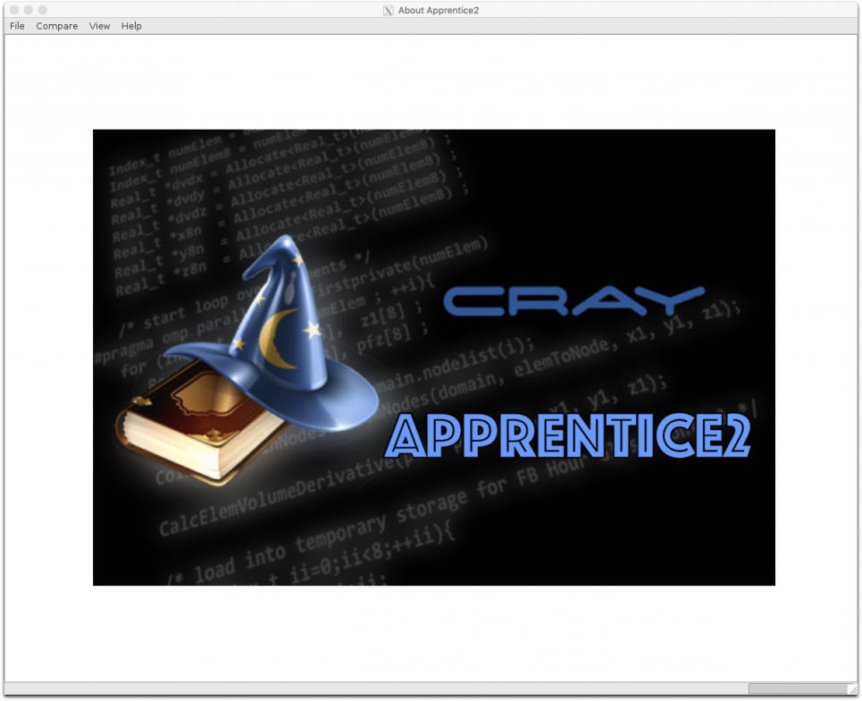
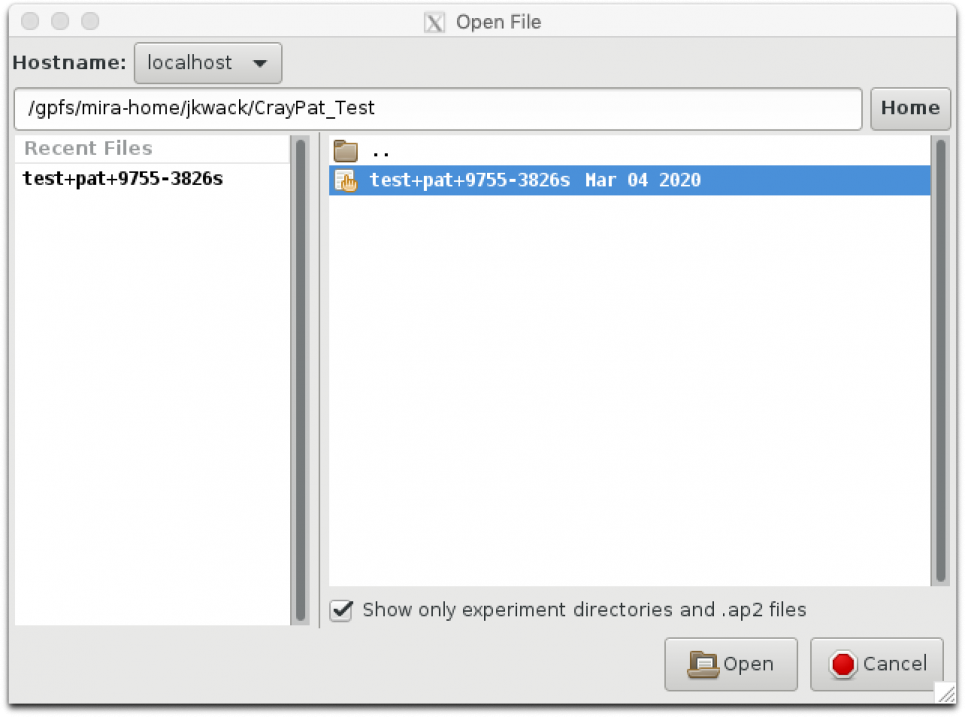
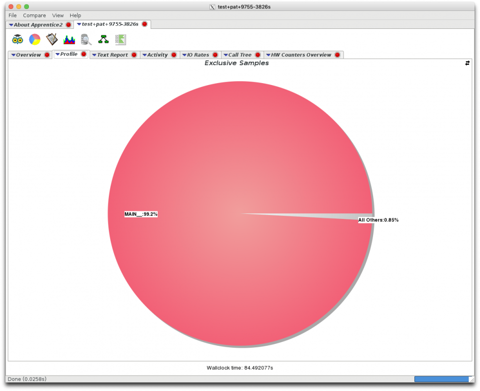
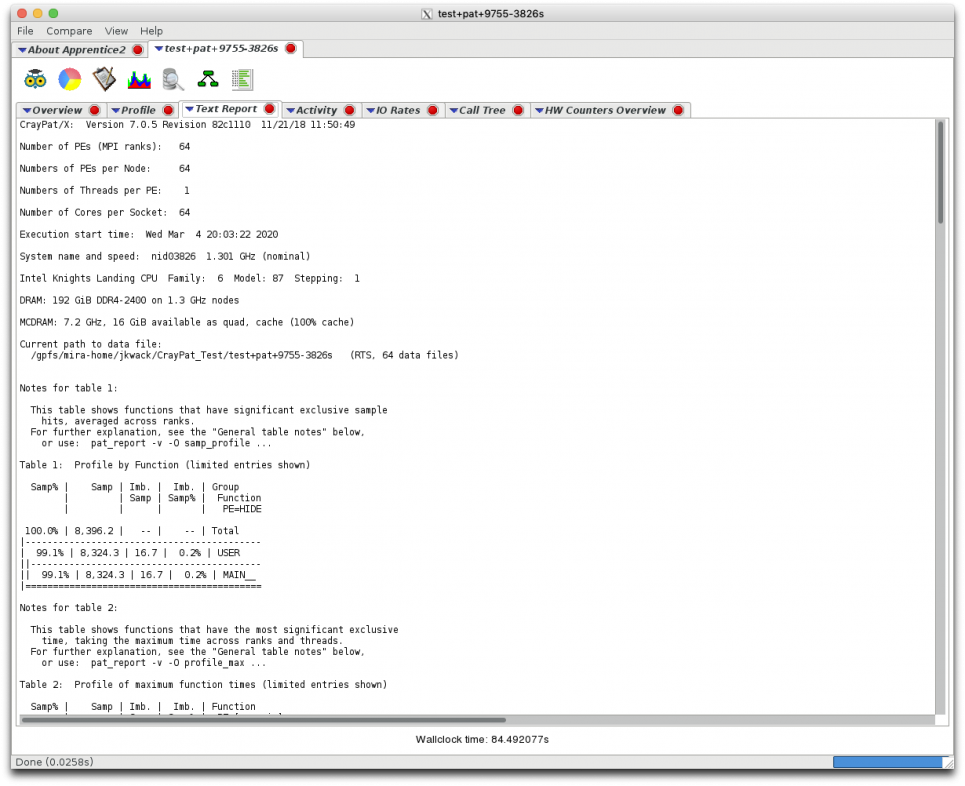
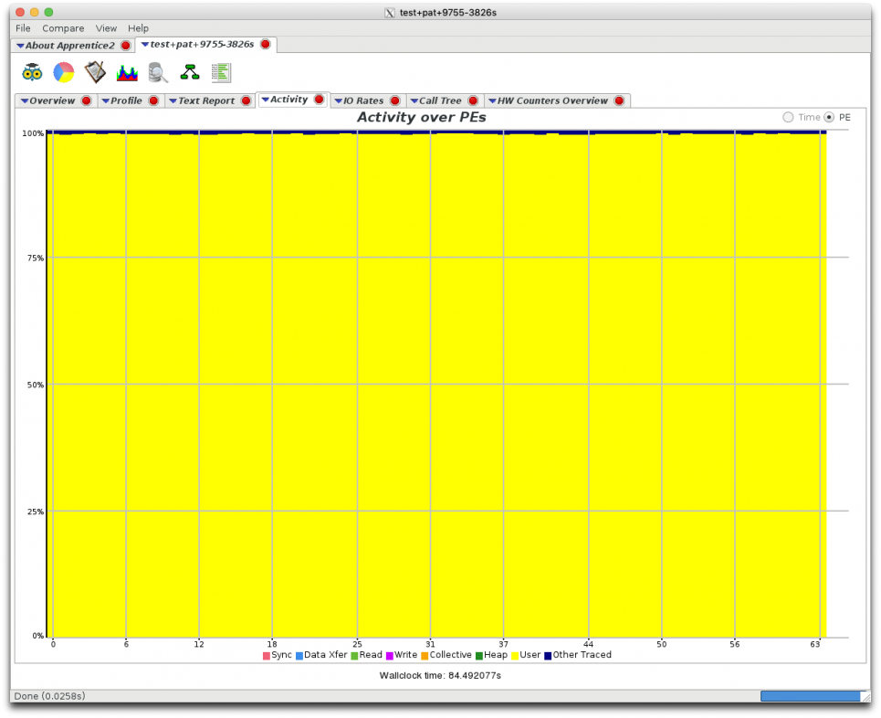
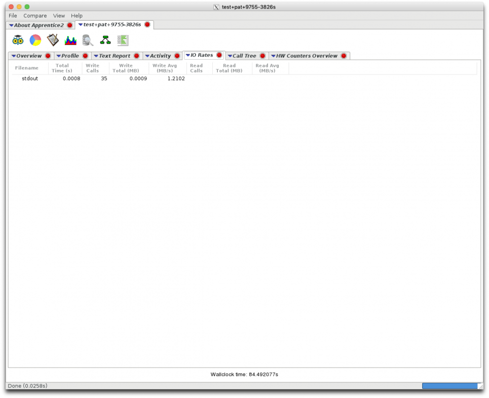
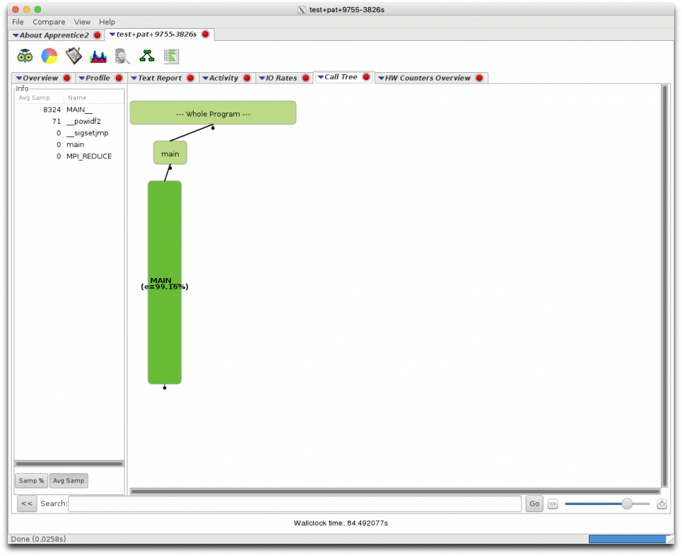
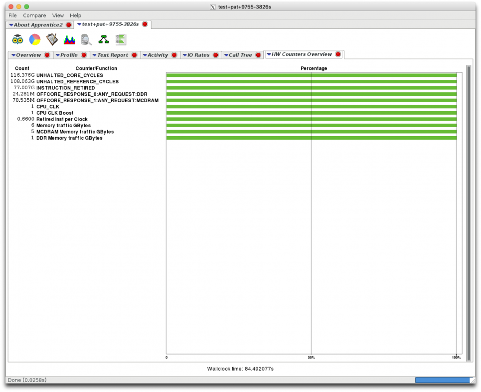

# CrayPat
## Introduction
The Cray Performance Measurement and Analysis Tools (or CrayPat) are a suite of utilities that enable the user to capture and analyze performance data generated during the execution of a program on a Cray system. It includes CrayPat, CrayPat-lite, Cray Apprentices2, Reveal and the Cray PAPI components. 

## References
- [Performance Profiling on KNL with Cray Perftools-lite]([https://www.alcf.anl.gov/sites/default/files/2019-07/slides%25202018-01-31%2520ALCF%2520Dev%2520Session%2520-%2520Heidi%2520Poxon%2520-%2520Cray%2520Performance%2520Tools_4.pdf](https://www.alcf.anl.gov/events/performance-profiling-knl-cray-perftools-lite-0))
- [CrayPAT User Guide Webpage on Cray Documentation Portal](https://pubs.cray.com/content/S-2376/7.0.0/cray-performance-measurement-and-analysis-tools-user-guide/about-the-cray-performance-measurement-and-analysis-tools-user-guide)
- [CrayPAT User Guide PDF Download from Cray Documentation Portal](https://pubs.cray.com/pdf-attachments/attachment?pubId=00505504-DA&attachmentId=pub_00505504-DA.pdf)
- Manual pages (after module is loaded): ```$ man perftools-lite```
- Detailed information about the output report: ```$ man pat_report```

## CrayPat-lite
This section focuses on CrayPat-lite, the simplified, easy-to-use version of the Cray Performance Measurement and Analysis Tool set. CrayPat-lite provides basic performance analysis information automatically, with a minimum of the user interaction. While CrayPat provides more functionalities. 

**1. Environment Setup**
To use CrayPat-lite, the appropriate module should be loaded, and darshan should be unloaded.
```
$ module unload darshan

$ module load perftools-lite
```
**Note:** 
- Darshan needs to be unloaded since it uses environment variables which CrayPat-lite also uses.
- Note that the perftools-base module should already be listed under “module list” If not, load perftools base with “module load perftools-base”. This provides access to man pages and help system, and does not instrument code. (Should be loaded by default.)
- “module load perftools-lite” loads performance instrumentation module, and will instrument programs when they are compiled.

**Tip:** To verify that the correct modules are loaded, run "module list" and check that perftools-lite and perftools-base are loaded and that darshan is not present.

**2. Compile the Code to Use CrayPat-lite**
Rebuild code as usual. When the program is built, there should be output like below, noting that CrayPat-lite was used.
```
$ make clean 
$ make ftn -O3 -qopt-report=5 -g -align array64byte test.f90 -o test 
INFO: creating the CrayPat-instrumented executable 'test' (sample_profile) ...OK
```
**Tip:** To verify that the executable was instrumented with CrayPat-lite, use the following command to search the executable for CrayPat strings:
```
$ strings test | grep "CrayPat/X" 
CrayPat/X: Version 7.0.0 Revision 5c29ce2 12/11/17 15:26:24
```
**3. Run the Code**
Run the code as usual
```
$ qsub -n 8 -t 30 -A project jobscript.sh

$ cat jobscript.sh

#!/bin/bash

aprun -n 512 -N 64 test
```
**4. Output**
After the code finishes executing, CrayPat-lite output should be printed to stdout (likely at the end of the jobid.output file). More output will be saved in .rpt files and .ap2 files, which might be under a new directory created in the directory the run occurred in.

An example of output is shown below. Note that it is truncated after Table 1, since this is just for illustration purposes.
```
$ cat 309226.output

…

Normal program output

…

#################################################################
#                                                               #
#            CrayPat-lite Performance Statistics                #
#                                                               #
#################################################################

 
CrayPat/X:  Version 7.0.0 Revision 5c29ce2  12/11/17 15:26:24
Experiment:                  lite  lite/sample_profile
Number of PEs (MPI ranks):    512
Numbers of PEs per Node:       64  PEs on each of  8  Nodes
Numbers of Threads per PE:      1
Number of Cores per Socket:    64
Execution start time:  Thu Mar 22 18:09:16 2018
System name and speed:  nid00690  1.301 GHz (nominal)
Intel Knights Landing CPU  Family:  6  Model: 87  Stepping:  1
MCDRAM: 7.2 GHz, 16 GiB available as quad, cache (100% cache)

 

Avg Process Time:           74.06 secs
High Memory:             21,298.6 MBytes     41.6 MBytes per PE
Instr per Cycle:             1.16
Observed CPU cycle rate:     1.39 GHz
I/O Read Rate:           1.899058 MBytes/sec
I/O Write Rate:          0.447113 MBytes/sec

Table 1:  Profile by Function
 

  Samp% |    Samp |  Imb. |  Imb. | Group
        |         |  Samp | Samp% |  Function=[MAX10]
        |         |       |       |   PE=HIDE
 100.0% | 7,355.9 |    -- |    -- | Total
|-------------------------------------------------------------
|  67.0% | 4,925.5 |    -- |    -- | USER
||------------------------------------------------------------
||  48.7% | 3,582.1 | 338.9 |  8.7% | genral_
||   9.9% |   726.7 |  85.3 | 10.5% | xyzint_
||   6.5% |   481.6 |  80.4 | 14.3% | rt123_
||============================================================
|  21.5% | 1,580.0 |    -- |    -- | BLAS
||------------------------------------------------------------
||   8.6% |   634.0 |  70.0 | 10.0% | gotoblas_dgetrf_single_knl
||   5.7% |   417.1 |  64.9 | 13.5% | gotoblas_dgemm_kernel_knl
||   2.3% |   168.5 |  34.5 | 17.0% | gotoblas_dlaswp_plus_knl
||   2.0% |   143.8 |  34.2 | 19.2% | gotoblas_dgemv_n_knl
||============================================================
|   8.7% |   637.3 |    -- |    -- | MPI
||------------------------------------------------------------
||   8.3% |   610.0 | 443.0 | 42.2% | MPI_ALLREDUCE
||============================================================
|   2.8% |   206.5 |    -- |    -- | ETC
||------------------------------------------------------------
||   2.6% |   193.8 |  60.2 | 23.7% | __svml_exp8_mask_b3
|=============================================================

```
By default, the sampling rate for CrayPat-lite is 100 times per second (or once every 104 microseconds) (check the runtime environment variable ```PAT_RT_SAMPLING_INTERVAL``` (given in microseconds)to verify the sampling rate).

Samp% is the percent of total samples taken which occurred in the given routine, averaged over all processes.

Samp is the number of samples which occurred in the given routine, averaged over all processes.

Imb. Samp is (maximum number of samples taken in given routine by one process - number of samples taken in given routine, averaged over all processes).

Imb. Samp% is (Imb. Samp) / (maximum number of samples taken in given routine by one process) * (number of processes / (number of processes - 1)) * 100%

Based on the above, 48.7% of total samples occurred in the genral_ routine, averaged over all processes, and the most samples taken in genral_ by one process process differed from the average by 338.9 samples. (If it was perfectly load balanced, Imb. Samp would be 0.) Additionally, 21.1% samples occurred in BLAS routines, averaged over all processes.

We can also see that this was run on 8 KNL nodes with 64 MPI ranks/node, for a total of 512 MPI processes.

Details explaining the output and how to get more information can be found in the references, training assets and the man page (above).

## CrayPat
CrayPat supports two categories of performance analysis experiments: tracing experiments, which count some event such as the number of times a specific system call is executed, and asynchronous (sampling) experiments, which capture values at specified time intervals or when a specified counter overflows.

**1. Environmental Setup**
To use CrayPat, unload darshan module and load perftools-base and perftools modules. 
```
jkwack@thetamom2:~/CrayPat_Test> module unload darshan
jkwack@thetamom2:~/CrayPat_Test> module load perftools-base perftools
```
**2. Build your application and instrument it with pat_build**
The pat_build command is the instrumenting component of the CrayPat performance analysis tool. After loading the perftools-base and perftools instrumentation modules and recompiling the program, use the pat_build command to instrument the program for data capture. There are several ways to instrument your application as follows:

For the default Automatic Profiling Analysis: ```$ pat_build a.out```

For predefined trace groups: ```$ pat_build -g tracegroup a.out```

For enabling tracing and the CrayPat API: ```$ pat_build -w a.out```

For instrumenting a single function: ```$ pat_build -T tracefunc a.out```

For instrumenting a list of functions: ```$ pat_build -t tracefile a.out```

The pat_build command is documented in more detail in the pat_build(1) man page. For additional information and examples, see pat_help build.

The following is an example on an interactive job mode on Theta:
```
jkwack@thetamom2:~/CrayPat_Test> ftn -dynamic -Ofast -fopenmp test.f90 -o test
WARNING: PerfTools is saving object files from a temporary directory into directory '/home/jkwack/.craypat/test/70303'
```

```
jkwack@thetamom2:~/CrayPat_Test> pat_build test
jkwack@thetamom2:~/CrayPat_Test> ls -al test*
-rwxr-xr-x 1 jkwack users   46568 Mar  4 19:57 test
-rw-r--r-- 1 jkwack users    6143 Mar  4 19:57 test.f90
-rwxr-xr-x 1 jkwack users 1399496 Mar  4 19:59 test+pat
```

**3. Run your instrumented binary**
Run your instrumented executable binary ending with +pat with your usual runtime parameters.
```
jkwack@thetamom2:~/CrayPat_Test> aprun -n 64 ./test+pat 4096 100

CrayPat/X:  Version 7.0.5 Revision 82c1110  11/21/18 11:50:49

                      Number of MPI process:     64

                                  Precision: double

       Number of rows/columns of the matrix:   4096

      The highest order of geometric series:    100

                      Number of repetitions:     10

                  Memory Usage per MPI rank:   268.435456 MB

          Warming up ......

          Main Computations  10 repetitions ......

          0%                     25%                      50%                     75%                     100%

          ||||||||||||||||||||||||||||||||||||||||||||||||||||||||||||||||||||||||||||||||||||||||||||||||||||

                        Error_MPI_{Min,Mean,Max}/MPI =   0.7878E-11    0.7878E-11    0.7878E-11

                       GFLOP-rate_{Min,Mean,Max}/MPI =     0.449981      0.451127      0.451217

                                           Wall Time =    74.568634 sec

                                           FLOP-rate =    28.798753 GFLOP/sec

Experiment data directory written:

/gpfs/mira-home/jkwack/CrayPat_Test/test+pat+9755-3826s

Application 19251348 resources: utime ~5395s, stime ~106s, Rss ~304068, inblocks ~20862, outblocks ~0
```

**4. Post-processing with pat_report**
The pat_report command is the text reporting component of the Cray Performance Analysis Tools suite. After using the pat_build command to instrument the program, set the run time environment variables as desired, and then execute the program, use the pat_report command to generate text reports from the resulting data and export the data for use in other applications.

The pat_report command is documented in detail in the pat_report(1) man page. Additional information can be found in the online help system under pat_help report.

The following is for the above example on an interactive mode on Theta:
```
kwack@thetamom2:~/CrayPat_Test> pat_report -o test.CrayPat_report.txt test+pat+9755-3826s

Processing step 1 of 9

Suggested trace options file:   test+pat+9755-3826s/build-options.apa

Processing step 9 of 9
```

See test.CrayPat_report.txt file for the detailed performance data:
```
jkwack@thetamom2:~/CrayPat_Test> cat test.CrayPat_report.txt

CrayPat/X:  Version 7.0.5 Revision 82c1110  11/21/18 11:50:49


Number of PEs (MPI ranks):   64

                           

Numbers of PEs per Node:     64

                           

Numbers of Threads per PE:    1

                           

Number of Cores per Socket:  64


Execution start time:  Wed Mar  4 20:03:22 2020


System name and speed:  nid03826  1.301 GHz (nominal)


Intel Knights Landing CPU  Family:  6  Model: 87  Stepping:  1


DRAM: 192 GiB DDR4-2400 on 1.3 GHz nodes


MCDRAM: 7.2 GHz, 16 GiB available as quad, cache (100% cache)


Current path to data file:

  /home/jkwack/CrayPat_Test/test+pat+9755-3826s   (RTS, 64 data files)


Notes for table 1:


  This table shows functions that have significant exclusive sample

    hits, averaged across ranks.

  For further explanation, see the "General table notes" below,

    or use:  pat_report -v -O samp_profile ...


Table 1:  Profile by Function (limited entries shown)


  Samp% |    Samp | Imb. |  Imb. | Group

        |         | Samp | Samp% |  Function

        |         |      |       |   PE=HIDE

       

100.0% | 8,396.2 |   -- |    -- | Total

|-------------------------------------------

|  99.1% | 8,324.3 | 16.7 |  0.2% | USER

||------------------------------------------

||  99.1% | 8,324.3 | 16.7 |  0.2% | MAIN__

|===========================================


Notes for table 2:


  This table shows functions that have the most significant exclusive

    time, taking the maximum time across ranks and threads.

  For further explanation, see the "General table notes" below,

    or use:  pat_report -v -O profile_max ...


Table 2:  Profile of maximum function times (limited entries shown)


  Samp% |    Samp | Imb. |  Imb. | Function

        |         | Samp | Samp% |  PE=[max,min]

|-----------------------------------------------

| 100.0% | 8,341.0 | 16.7 |  0.2% | MAIN__

||----------------------------------------------

|| 100.0% | 8,341.0 |   -- |    -- | pe.0

||  99.6% | 8,308.0 |   -- |    -- | pe.10

||==============================================

|   1.0% |    87.0 | 15.8 | 18.5% | __powidf2

||----------------------------------------------

||   1.0% |    87.0 |   -- |    -- | pe.10

||   0.7% |    60.0 |   -- |    -- | pe.3

|===============================================


Notes for table 3:


  This table shows functions, and line numbers within functions, that

    have significant exclusive sample hits, averaged across ranks.

  For further explanation, see the "General table notes" below,

    or use:  pat_report -v -O samp_profile+src ...


Table 3:  Profile by Group, Function, and Line (limited entries shown)


  Samp% |    Samp | Imb. |  Imb. | Group

        |         | Samp | Samp% |  Function

        |         |      |       |   Source

        |         |      |       |    Line

        |         |      |       |     PE=HIDE

       

100.0% | 8,396.2 |   -- |    -- | Total

|--------------------------------------------------------------------

|  99.1% | 8,324.3 |   -- |    -- | USER

||-------------------------------------------------------------------

||  99.1% | 8,324.3 |   -- |    -- | MAIN__

3|        |         |      |       |  /home/jkwack/CrayPat_Test/test.f90

||||-----------------------------------------------------------------

4|||  95.2% | 7,990.0 | 25.0 |  0.3% | line.180

4|||   2.0% |   168.2 | 28.8 | 14.9% | line.183

|====================================================================


Notes for table 4:


  This table shows HW performance counter data for the whole program,

    averaged across ranks or threads, as applicable.

  For further explanation, see the "General table notes" below,

    or use:  pat_report -v -O hwpc ...


Table 4:  Program HW Performance Counter Data (limited entries shown)


PE=HIDE


  

==============================================================================

  Total

------------------------------------------------------------------------------

  Thread Time                                     84.260105 secs

  UNHALTED_CORE_CYCLES                      116,375,995,355

  UNHALTED_REFERENCE_CYCLES                 108,063,453,270

  INSTRUCTION_RETIRED                        77,007,487,327

  OFFCORE_RESPONSE_0:ANY_REQUEST:DDR             24,281,189

  OFFCORE_RESPONSE_1:ANY_REQUEST:MCDRAM          78,534,610

  CPU_CLK                             1.38GHz               

  CPU CLK Boost                                        1.08 X

  Retired Inst per Clock                               0.66

  Memory traffic GBytes              0.078G/sec        6.58 GB

  MCDRAM Memory traffic GBytes       0.060G/sec        5.03 GB

  DDR Memory traffic GBytes          0.018G/sec        1.55 GB

==============================================================================


Notes for table 5:


  This table show the average time and number of bytes written to each

    output file, taking the average over the number of ranks that

    wrote to the file.  It also shows the number of write operations,

    and average rates.

  For further explanation, see the "General table notes" below,

    or use:  pat_report -v -O write_stats ...


Table 5:  File Output Stats by Filename (limited entries shown)


      Avg |      Avg |  Write Rate | Number |    Avg | Bytes/ | File Name=!x/^/(proc|sys)/

    Write |    Write | MiBytes/sec |     of | Writes |   Call |  PE=HIDE

Time per |  MiBytes |             | Writer |    per |        |

   Writer |      per |             |  Ranks | Writer |        |

     Rank |   Writer |             |        |   Rank |        |

          |     Rank |             |        |        |        |

|-----------------------------------------------------------------------------

| 0.000761 | 0.000921 |    1.211195 |      1 |   35.0 |  27.60 | stdout

|=============================================================================


Notes for table 6:


  This table shows energy and power usage for the nodes with the

    maximum, mean, and minimum usage, as well as the sum of usage over

    all nodes.

    Energy and power for accelerators is also shown, if applicable.

  For further explanation, see the "General table notes" below,

    or use:  pat_report -v -O program_energy ...


Table 6:

  Program energy and power usage (from Cray PM) (limited entries shown)


   Node |     Node |   Process | PE=HIDE

Energy |    Power |      Time |

    (J) |      (W) |           |

       

14,264 |  169.042 | 84.382329 | Total


Notes for table 7:


  This table shows memory traffic to DDR and MCDRAM for numa nodes,

    taking for each numa node the maximum value across nodes. It also

    shows the balance in memory traffic by showing the top 3 and

    bottom 3 node values.

  For further explanation, see the "General table notes" below,

    or use:  pat_report -v -O mem_bw_mcdram ...


Table 7:  Memory Bandwidth by Numanode (limited entries shown)


  Memory |     DDR |  MCDRAM |    Thread |  Memory | Numanode

Traffic |  Memory |  Memory |      Time | Traffic |  PE=HIDE

  GBytes | Traffic | Traffic |           |  GBytes |

         |  GBytes |  GBytes |           |   / Sec |

|--------------------------------------------------------------

|  421.13 |   99.46 |  321.68 | 84.492077 |    4.98 | numanode.0

|==============================================================


Notes for table 8:


  This table shows total wall clock time for the ranks with the

    maximum, mean, and minimum time, as well as the average across

    ranks.

    It also shows maximum memory usage from /proc/self/numa_maps for

    those ranks, and on average.  The usage is total size of all

    pages, including huge pages, that were actually mapped into

    physical memory from both private and shared memory segments.

  For further explanation, see the "General table notes" below,

    or use:  pat_report -v -O program_time ...


Table 8:  Wall Clock Time, Memory High Water Mark (limited entries shown)


   Process |   Process | PE=[mmm]

      Time |     HiMem |

           | (MiBytes) |

          

84.382329 |     282.2 | Total

|--------------------------------

| 84.616624 |     284.2 | pe.0

| 84.377615 |     281.8 | pe.31

| 84.345358 |     282.2 | pe.49

|================================


========================  Additional details  ========================


General table notes:


    The default notes for a table do not account for the effects

    of additional command-line options, but the detailed notes

    produced by the -v option do account for them.

    

    An imbalance metric in a line is based on values in main threads

    across multiple ranks, or on values across all threads, as applicable.

    

    An imbalance percent in a line is relative to the maximum value

    for that line across ranks or threads, as applicable.

    

Experiment:  samp_cs_time


Sampling interval:  10000 microsecs


Original path to data file:

  /gpfs/mira-home/jkwack/CrayPat_Test/test+pat+9755-3826s/xf-files   (RTS, 64 data files)


Original program:  /gpfs/mira-home/jkwack/CrayPat_Test/test


Instrumented with:  pat_build test


  Option file "apa" contained:

    -Drtenv=PAT_RT_PERFCTR=default_samp

    -Drtenv=PAT_RT_EXPERIMENT=samp_cs_time

    -Drtenv=PAT_RT_SAMPLING_MODE=3

    -g upc

    -g caf

    -g mpi

    -g shmem

    -g syscall

    -g io


Instrumented program:  ./test+pat


Program invocation:  ./test+pat 4096 100


Exit Status:  0 for 64 PEs


Memory pagesize:  4 KiB


Memory hugepagesize:  Not Available


Programming environment:  GNU


Runtime environment variables:

  CRAYPAT_ALPS_COMPONENT=/opt/cray/pe/perftools/7.0.5/sbin/pat_alps

  CRAYPAT_COMPILER_OPTIONS=1

  CRAYPAT_LD_LIBRARY_PATH=/opt/cray/pe/gcc-libs:/opt/cray/gcc-libs:/opt/cray/pe/perftools/7.0.5/lib64

  CRAYPAT_OPTS_EXECUTABLE=sbin/pat-opts

  CRAYPAT_ROOT=/opt/cray/pe/perftools/7.0.5

  CRAYPE_VERSION=2.6.1

  CRAY_LIBSCI_VERSION=19.06.1

  GCC_VERSION=8.3.0

  GNU_VERSION=8.3.0

  LIBSCI_VERSION=19.06.1

  MODULE_VERSION=3.2.11.3

  MODULE_VERSION_STACK=3.2.11.3

  MPICH_ABORT_ON_ERROR=1

  MPICH_DIR=/opt/cray/pe/mpt/7.7.10/gni/mpich-gnu/8.2

  PAT_BUILD_PAPI_BASEDIR=/opt/cray/pe/papi/5.6.0.5

  PAT_REPORT_PRUNE_NAME=_cray$mt_execute_,_cray$mt_start_,__cray_hwpc_,f_cray_hwpc_,cstart,__pat_,pat_region_,PAT_,OMP.slave_loop,slave_entry,_new_slave_entry,_thread_pool_slave_entry,THREAD_POOL_join,__libc_start_main,_start,__start,start_thread,__wrap_,UPC_ADIO_,_upc_,upc_,__caf_,__pgas_,syscall,__device_stub

  PAT_RT_EXPERIMENT=samp_cs_time

  PAT_RT_PERFCTR=default_samp

  PAT_RT_SAMPLING_MODE=3

  PERFTOOLS_VERSION=7.0.5

  PMI_FORK_RANK=0

  PMI_GNI_COOKIE=4202364928:4202430464

  PMI_GNI_DEV_ID=0:0

  PMI_GNI_LOC_ADDR=4978:4978

  PMI_GNI_PTAG=24:25


Report time environment variables:

    CRAYPAT_ROOT=/opt/cray/pe/perftools/7.0.5

    PAT_REPORT_PRUNE_NAME=_cray$mt_execute_,_cray$mt_start_,__cray_hwpc_,f_cray_hwpc_,cstart,__pat_,pat_region_,PAT_,OMP.slave_loop,slave_entry,_new_slave_entry,_thread_pool_slave_entry,THREAD_POOL_join,__libc_start_main,_start,__start,start_thread,__wrap_,UPC_ADIO_,_upc_,upc_,__caf_,__pgas_,syscall,__device_stub


Number of MPI control variables collected:  108


  (To see the list, specify: -s mpi_cvar=show)


Report command line options:  -o test.CrayPat_report.txt


Operating system:

  Linux 4.4.103-6.38_4.0.154-cray_ari_c #1 SMP Fri Aug 30 18:08:26 UTC 2019 (0e37142)


Hardware performance counter events:

   UNHALTED_CORE_CYCLES                   Unhalted core cycles

   UNHALTED_REFERENCE_CYCLES              Unhalted reference cycle

   INSTRUCTION_RETIRED                    Instructions retired (any thread modifier supported in fixed counter)

   OFFCORE_RESPONSE_0:ANY_REQUEST:DDR     Offcore response event (must provide at least one request type andeither any_response or any combination of supplier + snoop):Counts any request:accounts for responses from DDR (local and far)

   OFFCORE_RESPONSE_1:ANY_REQUEST:MCDRAM  Offcore response event (must provide at least one request type andeither any_response or any combination of supplier + snoop):Counts any request:accounts for responses from MCDRAM (local and far)
```

**5. In-depth Analysis: Using Cray Apprentice2**
Cray Apprentice2 is a GUI tool for visualizing and manipulating the performance analysis data captured during program execution. After using pat_report to open the initial .xf data file(s) and generate the .ap2 file(s), use Cray Apprentice2 to open and explore the .ap2 file(s) in further detail.

The following is an example on a login node on Theta:
```
jkwack@thetalogin5:~> module unload darshan
jkwack@thetalogin5:~> module load perftools-base perftools
jkwack@thetalogin5:~> app2
```

<figure markdown>
  { width="700" }
</figure>

<figure markdown>
  { width="700" }
</figure>

<figure markdown>
  { width="700" }
</figure>

<figure markdown>
  { width="700" }
</figure>

<figure markdown>
  { width="700" }
</figure>

<figure markdown>
  { width="700" }
</figure>

<figure markdown>
  { width="700" }
</figure>

<figure markdown>
  { width="700" }
</figure>

<figure markdown>
  { width="700" }
</figure>


